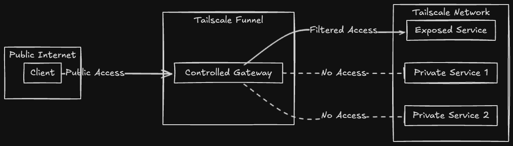
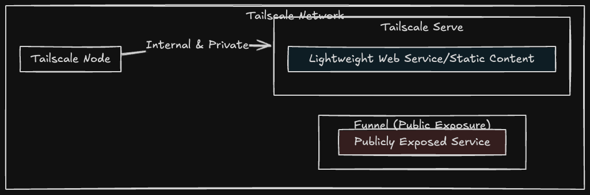

# ScaleTail - Tailscale Docker Sidecar Configuration Examples

This repository provides examples of using [Tailscale](https://tailscale.com/) in a sidecar configuration within Docker, specifically for integrating Tailscale with various services. By leveraging Tailscale's secure networking capabilities, these examples demonstrate how to seamlessly route traffic through Tailscale while maintaining service functionality and security.

The provided configurations showcase how to set up Tailscale alongside Docker services, with a focus on ensuring connectivity, security, and ease of deployment. The examples include configurations for Tailscale authentication, state management, and service routing.

If you would like to add your own config, you can use the [service-template](templates/service-template/) or simply open an [issue](https://github.com/2Tiny2Scale/tailscale-docker-sidecar-configs/issues).

## Table of Contents

- [ScaleTail - Tailscale Docker Sidecar Configuration Examples](#scaletail---tailscale-docker-sidecar-configuration-examples)
  - [Table of Contents](#table-of-contents)
  - [Available Configurations](#available-configurations)
    - [Networking and Security](#networking-and-security)
    - [Media and Entertainment](#media-and-entertainment)
    - [Productivity and Collaboration](#productivity-and-collaboration)
    - [Dashboards and Visualization](#dashboards-and-visualization)
    - [Development Tools](#development-tools)
    - [Monitoring and Analytics](#monitoring-and-analytics)
    - [Smart Home](#smart-home)
    - [Utilities](#utilities)
  - [Tailscale Information](#tailscale-information)
    - [Tailscale Funnel vs. Tailscale Serve](#tailscale-funnel-vs-tailscale-serve)
    - [Tailscale Funnel](#tailscale-funnel)
    - [Tailscale Serve](#tailscale-serve)
  - [Tailscale Documentation](#tailscale-documentation)
  - [License](#license)

## Available Configurations

### Networking and Security

| 🌐 Service                 | 📝 Description                                                                   | 🔗 Link                                  |
| ------------------------- | ------------------------------------------------------------------------------- | --------------------------------------- |
| 🛡️ **AdGuard Home**        | Network-wide software for blocking ads and tracking.                            | [Details](services/adguardhome)         |
| 🔄 **AdGuardHome Sync**    | A tool for syncing configuration across multiple AdGuard Home instances.        | [Details](services/adguardhome-sync)    |
| 🧩 **Pi-hole**             | A network-level ad blocker that acts as a DNS sinkhole.                         | [Details](services/pihole)              |
| 🔒 **Technitium DNS**      | An open-source DNS server that can be used for self-hosted DNS services.        | [Details](services/technitium)          |
| 🌐 **Caddy**               | Caddy is an extensible server platform that uses TLS by default.                | [Details](services/caddy)               |
| 🌐 **Traefik**             | A modern reverse proxy and load balancer for microservices.                     | [Details](services/traefik)             |
| 🚀 **Tailscale Exit Node** | Configure a device to act as an exit node for your Tailscale network.           | [Details](services/tailscale-exit-node) |
| 🌐 **DDNS Updater**        | A self-hosted solution to keep DNS A/AAAA records updated automatically.        | [Details](services/ddns-updater)        |
| 🔍 **Nessus**              | A powerful vulnerability scanner with a free Essentials model for home use.     | [Details](services/nessus)              |
| 🆔 **Pocket ID**           | A self-hosted decentralized identity (OIDC) solution for secure authentication. | [Details](services/pocket-id)           |

### Media and Entertainment

| 🎥 Service            | 📝 Description                                                                              | 🔗 Link                             |
| -------------------- | ------------------------------------------------------------------------------------------ | ---------------------------------- |
| 🎬 **Plex**           | A media server that organizes video, music, and photos from personal media libraries.      | [Details](services/plex)           |
| 📺 **Jellyfin**       | An open-source media system that puts you in control of managing and streaming your media. | [Details](services/jellyfin)       |
| 🎞️ **Radarr**         | A movie collection manager for Usenet and BitTorrent users.                                | [Details](services/radarr)         |
| 📡 **Sonarr**         | A PVR for Usenet and BitTorrent users to manage TV series.                                 | [Details](services/sonarr)         |
| 🎥 **Bazarr**         | A companion tool to Radarr and Sonarr for managing subtitles.                              | [Details](services/bazarr)         |
| 📡 **Prowlarr**       | An indexer manager and proxy for applications like Radarr, Sonarr, and Lidarr.             | [Details](services/prowlarr)       |
| 🎬 **Overseerr**      | A request management and media discovery tool for Plex and Jellyfin users.                 | [Details](services/overseerr)      |
| 📊 **Tautulli**       | A monitoring and tracking tool for Plex Media Server.                                      | [Details](services/tautulli)       |
| 📥 **qBittorrent**    | An open-source BitTorrent client.                                                          | [Details](services/qbittorrent)    |
| 🔗 **Slink**          | A fast, self-hosted alternative to ShareDrop for secure local file sharing.                | [Details](services/slink)          |
| 🎧 **Audiobookshelf** | A self-hosted audiobook and podcast server with multi-user support and playback syncing.   | [Details](services/audiobookshelf) |

### Productivity and Collaboration

| 💼 Service           | 📝 Description                                                                            | 🔗 Link                            |
| ------------------- | ---------------------------------------------------------------------------------------- | --------------------------------- |
| ☁️ **NextCloud**     | A suite of client-server software for creating and using file hosting services.          | [Details](services/nextcloud)     |
| 📝 **Excalidraw**    | A virtual collaborative whiteboard tool.                                                 | [Details](services/excalidraw)    |
| 🔗 **Pingvin Share** | **PROJECT ARCHIVED** A self-hosted file sharing platform.                                  | [Details](services/pingvin-share) |
| 🗂️ **Stirling-PDF**  | A web application for managing and editing PDF files.                                    | [Details](services/stirlingpdf)   |
| 🧠 **LanguageTool**  | An open-source proofreading software for multiple languages.                             | [Details](services/languagetool)  |
| 🔄 **Resilio Sync**  | A fast, reliable, and simple file sync and share solution.                               | [Details](services/resilio-sync)  |
| 🗃️ **Vaultwarden**   | An unofficial Bitwarden server implementation written in Rust.                           | [Details](services/vaultwarden)   |
| 🌿 **Isley**         | A self-hosted cannabis grow journal for tracking plants and managing grow data.          | [Details](services/isley)         |
| ✂️ **ClipCascade**   | A self-hosted clipboard manager for syncing and organizing clipboard history.            | [Details](services/clipcascade)   |
| 🔖 **Linkding**      | A self-hosted bookmark manager to save and organize links.                               | [Details](services/linkding)      |
| ✅ **DumbDo**        | A self-hosted, minimalistic task manager for simple to-do lists.                         | [Details](services/dumbdo)        |
| ✍️ **Ghost**         | A modern, open-source publishing platform for blogs and newsletters.                     | [Details](services/ghost)         |
| 📝 **Nanote**        | A lightweight, self-hosted note-taking app with Markdown support.                        | [Details](services/nanote)        |
| ✅ **Eigenfocus**    | A self-hosted task and project management tool for productivity.                         | [Details](services/eigenfocus)    |
| 🔖 **Haptic**        | Haptic is a new local-first & privacy-focused, open-source home for your markdown notes. | [Details](services/haptic)        |
| 📝 **Flatnotes**     | A simple, self-hosted note-taking app using Markdown files.                              | [Details](services/flatnotes)     |
| ✅ **Donetick**      | A self-hosted task and checklist manager for productivity.                               | [Details](services/donetick)      |
| 🗂️ **Kaneo**         | A modern, self-hosted project management platform focused on simplicity.                 | [Details](services/kaneo)         |
| 🗒️ **Karakeep**      | A self-hosted, collaborative note-taking app — a private alternative to Google Keep.     | [Details](services/karakeep)      |

### Dashboards and Visualization

| 📊 Service      | 📝 Description                                                                        | 🔗 Link                       |
| -------------- | ------------------------------------------------------------------------------------ | ---------------------------- |
| 🧭 **Glance**   | A concise, customizable dashboard for self-hosted services and personal metrics.     | [Details](services/glance)   |
| 🏠 **Homepage** | A modern, highly customizable homepage for organizing links and monitoring services. | [Details](services/homepage) |

### Development Tools

| 🛠️ Service                | 📝 Description                                                                            | 🔗 Link                              |
| ------------------------ | ---------------------------------------------------------------------------------------- | ----------------------------------- |
| 🔧 **Cyberchef**          | A web app for encryption, encoding, compression, and data analysis.                      | [Details](services/cyberchef)       |
| 🔍 **searXNG**            | A free internet metasearch engine which aggregates results from various search services. | [Details](services/searxng)         |
| 🖥️ **Node-RED**           | A flow-based development tool for visual programming.                                    | [Details](services/nodered)         |
| 🖥️ **IT-Tools**           | A collection of handy online tools for developers and sysadmins.                         | [Details](services/it-tools)        |
| 🖥️ **Dozzle**             | A real-time log viewer for Docker containers.                                            | [Details](services/dozzle)          |
| 🖥️ **Portainer**          | A lightweight management UI which allows you to easily manage your Docker environments.  | [Details](services/portainer)       |
| 🖥️ **Gokapi**             | A lightweight self-hosted file sharing platform.                                         | [Details](services/gokapi)          |
| 🖥️ **Homarr**             | A sleek dashboard for all your Homelab services.                                         | [Details](services/homarr)          |
| 🖥️ **Changedetection.io** | A tool for monitoring website changes.                                                   | [Details](services/changedetection) |

### Monitoring and Analytics

| 📈 Service               | 📝 Description                                                                            | 🔗 Link                                |
| ----------------------- | ---------------------------------------------------------------------------------------- | ------------------------------------- |
| 📊 **Uptime Kuma**       | A self-hosted monitoring tool like "Uptime Robot".                                       | [Details](services/uptime-kuma)       |
| 📉 **Beszel**            | A lightweight server monitoring hub with historical data, Docker stats, and alerts.      | [Details](services/beszel)            |
| 🚀 **Speedtest Tracker** | A self-hosted tool to monitor and log internet speed tests with detailed visualizations. | [Details](services/speedtest-tracker) |

### Smart Home

| 🏠 Service            | 📝 Description                                                          | 🔗 Link                             |
| -------------------- | ---------------------------------------------------------------------- | ---------------------------------- |
| 🏡 **Home Assistant** | An open-source home automation platform for controlling smart devices. | [Details](services/home-assistant) |

### Utilities

| 📱 Service      | 📝 Description                                                                        | 🔗 Link                       |
| -------------- | ------------------------------------------------------------------------------------ | ---------------------------- |
| 📱 **Mini-QR**  | A minimal, self-hosted QR code generator with a mobile-friendly UI.                  | [Details](services/mini-qr)  |
| 🔁 **ConvertX** | A fast, full-featured self-hosted conversion API for images, docs, videos, and more. | [Details](services/convertx) |
| 🚀 **N8N** | A flexible AI Workflow automation platform. Community Edition | [Details](services/n8nce) |

## Tailscale Information

### Tailscale Funnel vs. Tailscale Serve

Tailscale Funnel securely exposes services to the public internet. Tailscale Serve is for sharing content within a private Tailscale network (Tailnet). You'll need to decide how you want to expose the service, the configurations in this repository exposes the local Tailnet.

### Tailscale Funnel

[Tailscale Funnel](https://tailscale.com/kb/1223/funnel) is a feature that lets you route traffic from the wider internet to a local service running on a machine in your Tailscale network (known as a Tailnet). You can think of this as publicly sharing a local service, like a web app, for anyone to access—even if they don’t have Tailscale themselves.

An example configuration for Tailscale Funnel for your service is [available here](funnel-serve/funnel-example.json).

### Tailscale Serve

[Tailscale Serve](https://tailscale.com/kb/1312/serve) is a feature that lets you route traffic from other devices on your Tailscale network (known as a Tailnet) to a local service running on your device. You can think of this as sharing the service, such as a website, with the rest of your Tailnet.

An example configuration for Tailscale Serve for your service is [available here](funnel-serve/serve-example.json).

## Tailscale Documentation

- [Tailscale.com - Knowledge Base](https://tailscale.com/kb)
- [Tailscale.com - Funnel](https://tailscale.com/kb/1223/funnel)
- [Tailscale.com - Serve](https://tailscale.com/kb/1242/tailscale-serve)
- [Tailscale.com - Docker Tailscale Guide](https://tailscale.com/blog/docker-tailscale-guide)

## License

[MIT](https://choosealicense.com/licenses/mit/)
